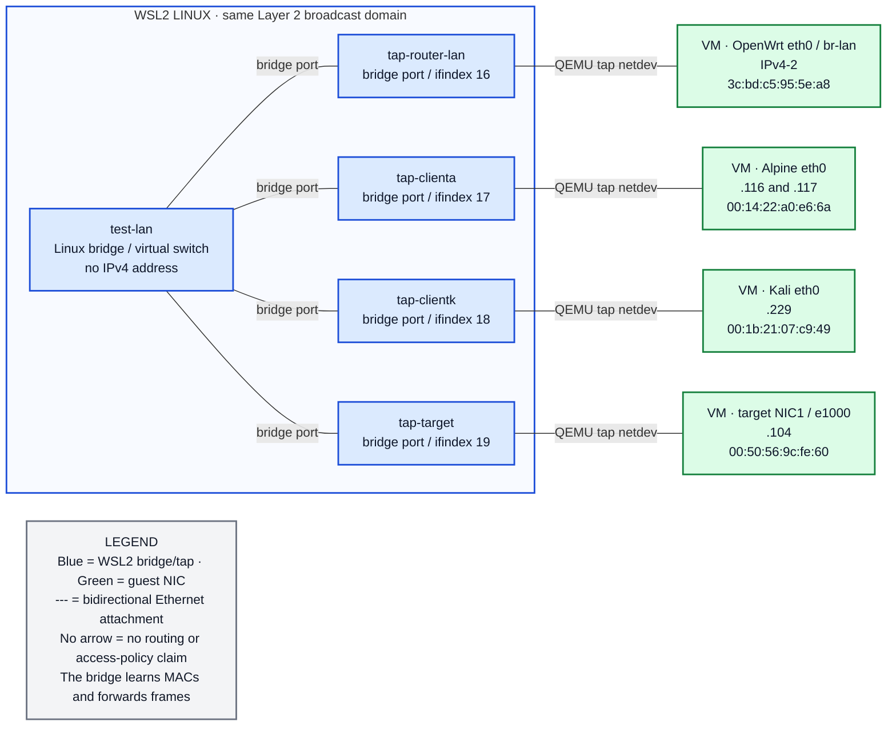
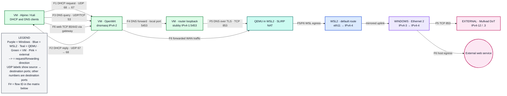

# Overdrive lab network — SP 800-53 review map

**Live snapshot:** 2026-09-30, 14:10–14:16 EDT; Windows and WSL interface mapping checked later the same day. All four QEMU guests were running from existing disks. IPv4 leases, MACs, routes, bridge ports, serial listeners, guest services, and selected TCP ports were checked live. Dynamic addresses and host routes may change. This is a **proposed review scope** covering the Windows host, WSL2, QEMU, and four VMs; the formal authorization boundary and control baseline still need an owner decision.

The figures and tables provide topology evidence for [NIST SP 800-53 Rev. 5](https://csrc.nist.gov/pubs/sp/800/53/r5/upd1/final). They do **not** establish control compliance; [SP 800-53A Rev. 5](https://csrc.nist.gov/pubs/sp/800/53/a/r5/final) describes control assessment procedures.

## Figure 1 — where each layer runs

The nested boxes show **runtime containment only**. Windows is the physical host. WSL2 is a Linux VM on Windows. Four separate QEMU/KVM processes run inside WSL2 and create the lab guests. A network address repeated on Windows and WSL is a mirrored interface, not an extra hop or a second subnet.

~~~mermaid
flowchart TB
    subgraph WIN["WINDOWS PHYSICAL HOST · outer platform"]
        WinNIC["Ethernet 2 · IPv4-3 gateway IPv4-4 · default uplink"]
        WinWiFi["Wi-Fi · IPv4-5 gateway IPv4-6 · secondary"]
        WinFW["Windows / WSL firewall WSL firewall configured on; effective rules untested"]
        subgraph WSL["WSL2 LINUX VM · mirrored networking"]
            LinuxNIC["eth11 mirrors Ethernet 2 eth7 mirrors Wi-Fi"]
            Bridge["test-lan · Linux bridge in WSL2 four tap ports · no bridge IP"]
            Serial["WSL loopback · IPv4-1 QEMU serial TCP 2324–2327 Windows localhost: 2324–2326 reached"]
            subgraph QEMU["FOUR QEMU/KVM PROCESSES RUN INSIDE WSL2"]
                Router["OpenWrt VM LAN .1 · WAN IPv4-7"]
                Alpine["Alpine VM LAN .116 + .117"]
                Kali["Kali VM LAN .229"]
                Target["Metasploitable VM LAN .104"]
            end
        end
    end
    Legend["LEGEND Nested boxes = runs inside; there are NO traffic arrows here Purple = Windows · Blue = WSL2 · Teal = QEMU · Green = guest VM Pink in later figures = external endpoint"]

    classDef windows fill:#EDE9FE,stroke:#7C3AED,stroke-width:2px,color:#0F172A
    classDef wsl fill:#DBEAFE,stroke:#1D4ED8,stroke-width:2px,color:#0F172A
    classDef vm fill:#DCFCE7,stroke:#15803D,stroke-width:2px,color:#0F172A
    classDef legend fill:#F3F4F6,stroke:#6B7280,stroke-width:2px,color:#111827
    class WinNIC,WinWiFi,WinFW windows
    class LinuxNIC,Bridge,Serial wsl
    class Router,Alpine,Kali,Target vm
    class Legend legend
    style WIN fill:#FAF7FF,stroke:#7C3AED,stroke-width:3px
    style WSL fill:#F8FAFF,stroke:#1D4ED8,stroke-width:2px
    style QEMU fill:#F0FDFA,stroke:#0F766E,stroke-width:2px
~~~

Windows .wslconfig has networkingMode=mirrored, dnsTunneling=true, and firewall=true. Read-only Windows inventory matched Ethernet 2 to WSL eth11 (IPv4-3) and Wi-Fi to WSL eth7 (IPv4-5). The Windows host itself has the Ethernet 2 default gateway; QEMU is not the Windows uplink.

## Figure 2 — outbound packet path

Arrows in this figure mean **outbound forwarding toward the next component**, not containment or permission. The WSL-to-Windows arrow marks the mirrored uplink boundary, not a separate IP next hop. The upper route starts at a lab client. The lower route starts on Windows itself. Return packets travel in reverse. SLIRP sits after the OpenWrt WAN and before WSL's normal IP routing because it is QEMU's user-mode network backend. The router WAN is **not** a port on test-lan.

~~~mermaid
flowchart LR
    Client["GUEST VMs Alpine .116/.117 · Kali .229 target .104: egress untested"]
    Bridge["WSL2 · test-lan bridge client tap → tap-router-lan"]
    RouterLAN["OpenWrt VM LAN eth0 gateway IPv4-2"]
    RouterWAN["OpenWrt VM WAN eth1 IPv4-7 · LAN→WAN policy"]
    SLIRP["QEMU in WSL2 · SLIRP IPv4-8 · outbound NAT no inbound hostfwd"]
    WSLRoute["WSL2 Linux routing default: eth11 → IPv4-4"]
    WinNIC["Windows Ethernet 2 mirrored uplink · IPv4-3"]
    WindowsApp["Windows host traffic separate direct Internet path"]
    Gateway["UPSTREAM · IPv4-4"]
    Internet((Internet / outside systems))
    Legend["LEGEND Green = guest VM · Blue = WSL2 · Teal = QEMU backend Purple = Windows · Pink = external --> = outbound next hop or forwarding stage; replies reverse A line shows a route, not a firewall allow decision"]

    Client -->|outbound via .1| Bridge
    Bridge -->|tap-router-lan; Ethernet frames| RouterLAN
    RouterLAN -->|router forwards permitted traffic| RouterWAN
    RouterWAN -->|WAN traffic to IPv4-8| SLIRP
    SLIRP -->|host socket uses Linux route| WSLRoute
    WSLRoute -->|mirrored Ethernet 2 path| WinNIC
    WindowsApp -->|Windows default route| WinNIC
    WinNIC -->|default gateway| Gateway
    Gateway -->|upstream route; next hops unverified| Internet

    classDef windows fill:#EDE9FE,stroke:#7C3AED,stroke-width:2px,color:#0F172A
    classDef wsl fill:#DBEAFE,stroke:#1D4ED8,stroke-width:2px,color:#0F172A
    classDef qemu fill:#CCFBF1,stroke:#0F766E,stroke-width:2px,color:#0F172A
    classDef vm fill:#DCFCE7,stroke:#15803D,stroke-width:2px,color:#0F172A
    classDef external fill:#FCE7F3,stroke:#BE185D,stroke-width:2px,color:#0F172A
    classDef legend fill:#F3F4F6,stroke:#6B7280,stroke-width:2px,color:#111827
    class Client,RouterLAN,RouterWAN vm
    class Bridge,WSLRoute wsl
    class SLIRP qemu
    class WinNIC,WindowsApp windows
    class Gateway,Internet external
    class Legend legend
~~~

**Route qualification:** WSL ip route get IPv4-9 selected eth11 via IPv4-4; Windows reports the same address and gateway on Ethernet 2. WSL also had a specific route to IPv4-10 via IPv4-6 on eth7, matching the Windows Wi-Fi network. The drawn SLIRP-to-uplink path follows observed routes and QEMU configuration; no end-to-end packet capture or Windows filtering test confirms every forwarding stage. The upstream gateway's next hops remain unknown.

## Figure 3 — what the bridge and taps actually are

`test-lan` is a **virtual Ethernet switch inside WSL2 Linux**. Each blue `tap-*` node is one switch port created inside WSL2. QEMU opens that tap and presents it as the green NIC inside its VM. A tap has no guest IP of its own; Ethernet frames pass both ways through it. All four taps share one broadcast domain, so DHCP broadcasts reach OpenWrt without the bridge routing or NATing them. The router's `eth1` WAN is absent from this figure because it connects to SLIRP instead.

The bridge has no IPv4 address in normal operation, but that **does not isolate it from WSL administrators**: a temporary `IPv4-11/24` host bridge address enabled the live scans below, then was removed. The live bridge also reported `nf_call_iptables=0`; Linux bridge forwarding is not being filtered through host iptables on that path. Guest and router policies still apply at their own interfaces.

## Figure 4 — named traffic flows

Arrows show the **sender → next recipient**, with destination ports in the labels. Replies travel in the reverse direction. Flow IDs match the review table below. A drawn flow is a path to assess, not proof that every packet was observed.

## Asset and address inventory

| Asset/interface | Live assignment | Management and identity | Evidence |
|---|---|---|---|
| Windows `Ethernet 2` | `IPv4-3`; gateway `IPv4-4` | Default host uplink mirrored into WSL2 | W1 |
| Windows `Wi-Fi` | `IPv4-5`; gateway `IPv4-6` | Secondary host network mirrored into WSL2 | W1 |
| WSL2 `eth11` | `IPv4-3/20`; default route via `IPv4-4` | WSL default route; gateway owner unknown | H1, W1 |
| WSL2 `eth7` | `IPv4-5/22`; local `IPv4-13/22`; specific route via `IPv4-6` | Secondary WSL network, not default | H1, W1 |
| WSL2 `test-lan` | No WSL IPv4; bridge MAC `02:8e:f4:d4:f6:1d` | Four tap ports; STP off; bridge netfilter hook off | H2 |
| OpenWrt LAN/WAN | `IPv4-2/24` and `IPv4-7/24` | LAN/WAN MACs `3c:bd:c5:95:5e:a8` / `3c:bd:c5:52:d6:d5`; WSL serial `IPv4-1:2324` | G1, H2 |
| Alpine `eth0` | `IPv4-14/24` **and** `.117/24`; route source `.117` | MAC `00:14:22:a0:e6:6a`; WSL serial `IPv4-1:2325` | G1, G2 |
| Kali `eth0` | `IPv4-15/24`; gateway/DNS `.1` | MAC `00:1b:21:07:c9:49`; WSL serial `IPv4-1:2326` | G1, G2 |
| Metasploitable `NIC1` | `IPv4-16` from DHCP lease and ARP | MAC `00:50:56:9c:fe:60`; WSL serial socket `IPv4-1:2327` accepts, but no guest prompt | G1, H2, N1 |

OpenWrt's live DHCP pool is `IPv4-17`–`.249` with 12-hour leases. It gives `IPv4-2` as DNS (option 6); Alpine and Kali use `.1` as their default gateway. Alpine has **two leases from two DHCP clients**, so its two addresses should be treated as a configuration issue rather than reservations. OpenWrt also reported IPv6 ULA `IPv6-1/60` with DHCPv6/RA configured; the Alpine/Kali hardening scripts configure IPv6 DROP policies.

## Port and exposure inventory

**Destination ports, snapshot only.** “Listening” means a process bound locally; “open” means a TCP connect from the temporary host address on `test-lan` succeeded. The two observations are different. An upstream reachability test was not performed.

| Endpoint / boundary | Observed ports | Exposure and enforcement | Evidence |
|---|---|---|---|
| WSL2 on `eth11` / `eth7` | TCP `631` (`cupsd`) bound `IPv4-18` and `[IPv6-2]` | Potential WSL/Windows network entry point. Linux `iptables` INPUT policy was ACCEPT; Windows/WSL or upstream filtering and remote reachability are **unknown**. | H3 |
| WSL2 local DNS | TCP/UDP `53` on `IPv4-19`, `IPv4-20`, `IPv4-21` | Local WSL resolver addresses; `IPv4-21/32` is on loopback. These are not the lab's OpenWrt DNS service. | H1, H3 |
| WSL2 QEMU serial | TCP `2324` router, `2325` Alpine, `2326` Kali, `2327` target, all `IPv4-1` | Bound to WSL2 loopback; Windows localhost connected to 2324–2326; 2327 timed out in the later check. Router/Alpine/Kali had usable WSL guest prompts; target guest prompt absent. | H3, G2, W2 |
| OpenWrt LAN `.1` | **Open TCP** `22` SSH, `53` DNS, `80` HTTP, `443` HTTPS; **listening UDP** `53` DNS, `67` DHCP | LAN zone INPUT/OUTPUT/FORWARD ACCEPT. Services bind broadly in guest; WAN zone INPUT REJECT and FORWARD DROP in UCI, and QEMU has no `hostfwd`. WAN effectiveness not independently tested. | G1, N1, C1 |
| OpenWrt loopback | TCP/UDP `5453` stubby | DNS forwarding inside router; configured DoT upstream TCP `853`. Kali/router DNS lookups worked, but no TLS packet capture proves each upstream. | G1, G2, C1 |
| Alpine `.116/.117` | UDP `68` DHCP client; no listening TCP socket in guest | Live IPv4 INPUT/OUTPUT/FORWARD policies are DROP. Broad LAN TCP scan was filtered/timed out, so it is not a complete negative scan. | G2, G3, C1, N1 |
| Kali `.229` | UDP `68` DHCP client; no listening TCP socket in guest | Live IPv4 INPUT/OUTPUT/FORWARD policies are DROP. Broad LAN TCP scan was filtered/timed out. | G2, G3, C1, N1 |
| Metasploitable `.104` | **Open TCP** `21, 22, 23, 25, 53, 111, 139, 445, 512–514, 1099, 1524, 2049, 2121, 3306, 3632, 5432, 5900, 6000, 6667, 6697, 8009, 8180` | Open from temporary host bridge address. This is the intentionally unhardened target; UDP and other unscanned TCP ports remain unknown. TCP `80` did **not** appear open in this scan. | N1 |
| QEMU SLIRP WAN | No fixed inbound host port forward | Router WAN uses QEMU `-netdev user,id=wan`; the QEMU process also has dynamic UDP source sockets, which are not stable listening services. | C1, H3 |

## Flow and control evidence matrix

| ID | Source → destination | Protocol / purpose | Enforcement or boundary | Observation and remaining check |
|---|---|---|---|---|
| F1–F2 | Clients ↔ OpenWrt `.1` | DHCP UDP `68`↔`67`; pool `.100`–`.249`, 12 h | Shared `test-lan` Layer 2 | Leases for Alpine, Kali, and the target in dnsmasq; Alpine duplicate lease needs correction. |
| F3 | Alpine/Kali → OpenWrt `.1` | DNS UDP/TCP `53` | Guest firewalls allow `.1:53` | Kali `nslookup example.com` succeeded; Alpine resolver is `.1`. |
| F4–F5 | dnsmasq → local stubby → Mullvad | Router loopback `5453`, outbound DoT TCP `853` | OpenWrt DNS config; WAN → SLIRP → host egress | Config and listener verified; packet-level DoT destination/path not captured. |
| F6 | Lab clients → OpenWrt → SLIRP → WSL/Windows uplink | Web TCP `80/443` outbound via `.1` gateway | Client outbound rules, OpenWrt LAN→WAN forwarding, SLIRP NAT | Configuration and routes verified; end-to-end web egress not separately captured. |
| F7 | Windows host / WSL2 → upstream gateway → Internet | Windows Ethernet 2 and mirrored WSL eth11 via `IPv4-4` | Windows/WSL rules untested; Linux INPUT policy ACCEPT | Both default routes observed. Upstream firewall and reachability from outside remain unknown. |
| F8 | WSL2 loopback → VM COM1 | TCP `2324`–`2327` | Bound WSL `IPv4-1`; separate from lab LAN | WSL listeners observed; Windows localhost connected to 2324–2326 and timed out on 2327; target lacks guest serial prompt. |
| F9 | Lab peer/host scan point → target `.104` | Selected TCP ports listed above | Same L2 segment; guest-specific firewalls determine reachability | Scan from temporary host `.254` succeeded. Client-to-target reachability is more restricted and not assumed. |
| F10 | Upstream → WSL2 `cupsd` | TCP `631` inbound if network permits | Host service bound all interfaces; outer filtering unknown | Listener observed; no external reachability test. |

## SP 800-53 review use and open evidence

This is **input to** a control assessment, not a pass/fail assertion. The mappings below are based on the [official SP 800-53 control catalog](https://csrc.nist.gov/pubs/sp/800/53/r5/upd1/final); actual applicability depends on the system's selected baseline and organizational policy.

| Control | What this map provides | Evidence still needed for an assessment |
|---|---|---|
| **PL-2 — System Security and Privacy Plans** | Components, operational connections, external dependencies, proposed scope | Approved authorization boundary, system owner, data types, system categorization, selected baseline, and documented responsibilities. |
| **CM-8 — System Component Inventory** | Host/guest NICs, current IPs/MACs, taps, QEMU role, port inventory | Stable asset IDs, owners, OS/build versions, disk provenance, update process, and treatment of dynamic MAC/IP changes. |
| **SC-7 — Boundary Protection** | Host uplinks, lab bridge, router WAN, SLIRP NAT, serial plane, external ports | Test upstream reachability of host TCP `631`; verify Windows/WSL firewall; test router WAN policy; document whether target egress should be restricted. |
| **AC-4 — Information Flow Enforcement** | F1–F10 source/destination/protocol matrix and observed/configured status | Approved flow policy, firewall rule evidence, blocked-flow tests from each zone, and packet captures for DoT and outbound traffic. |

**Review questions raised by the snapshot:** host TCP `631` is bound on all interfaces while the Linux INPUT policy is ACCEPT; the target exposes many services on the lab LAN; OpenWrt's LAN zone allows forwarding to WAN; Alpine has two DHCP leases; the target's serial socket has no guest prompt. These are observations and assessment leads. Their risk and compliance status require the approved boundary, policy, and additional tests.

## Evidence record and limits

| ID | Live evidence source | Scope |
|---|---|---|
| W1 | Windows .wslconfig and read-only Get-NetIPConfiguration | Mirrored mode and Windows NIC IP/gateway mapping; firewall effectiveness and Internet reachability not tested. |
| W2 | Windows localhost TCP connect to QEMU serial ports 2324–2327 | 2324–2326 connected; 2327 timed out. Local access only; no remote reachability test. |
| H1 | WSL `ip -br addr`, `ip -4 route`, `ip route get IPv4-9` | WSL addresses/default and specific routes; no upstream path trace. |
| H2 | `bridge link`, bridge FDB, `ip -d link show test-lan` | Four forwarding tap ports, learned guest MACs, bridge settings. |
| H3 | `sudo ss -lntup`, `sudo nft list ruleset`, `sudo iptables-save` | WSL bind addresses and Linux firewall state; Windows firewall not assessed. |
| G1 | OpenWrt serial: `ip route`, `ifconfig`, `uci show dhcp.lan`, `/tmp/dhcp.leases`, `uci show firewall`, `netstat` | Router addressing, DHCP, zones, listeners; UCI is configuration evidence, not a WAN effectiveness test. |
| G2 | Alpine/Kali serial: `ip addr`, `ip route`, resolver, guest listeners; Kali DNS lookup | Client addresses, routes, DNS, listener state. |
| G3 | Alpine/Kali serial: firewall service status and `iptables -S` | Both guest services active; IPv4 INPUT/OUTPUT/FORWARD policies DROP with specific exceptions. |
| C1 | [`common_qemu.py`](../detections/common/common_qemu.py), [`openwrt_assets.py`](../VM/openwrt_router/openwrt_assets.py), client firewall scripts | Launch topology and configured policies. |
| N1 | WSL `nmap -n -Pn -sT` using temporary `IPv4-11/24` on `test-lan` | TCP `1`–`1024` plus selected higher ports. Temporary address removed. UDP and remote WAN exposure not exhaustively scanned. |

Kali's prebuilt image lacked `dhclient`, so its initial boot had no lease. The running guest and [`VM/kali_client/guest_scripts.py`](../VM/kali_client/guest_scripts.py) now fall back to installed `dhcpcd`; Kali obtained `.229`, its `lab-net-up.service` is active, and DNS resolution worked. The four VMs were left running.
